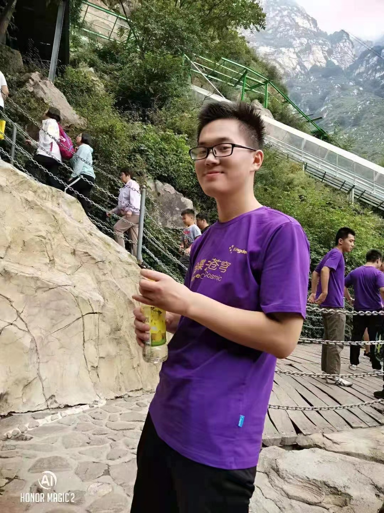
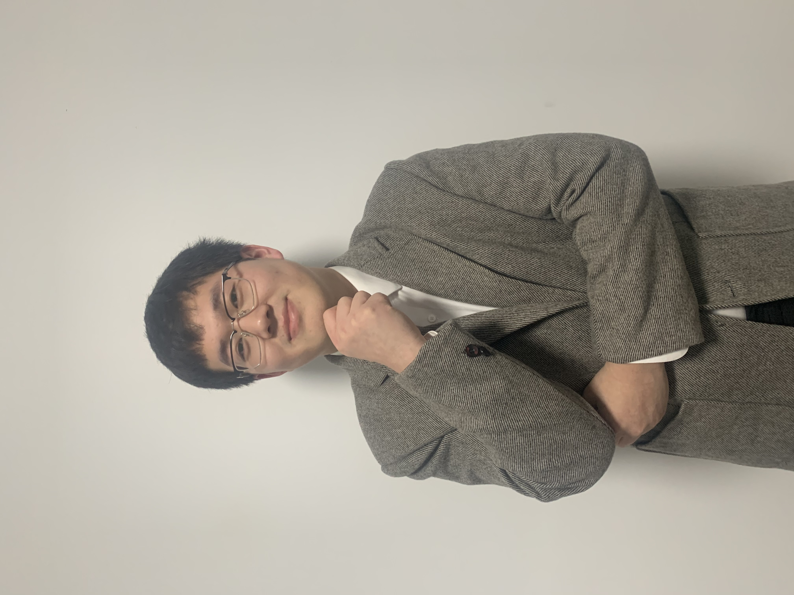

## 自我介绍

97年男生 石家庄铁道大学 本科 程序员 身高172 坐标石家庄市长安区

## 个人基本信息

|||
|:---:|:---:|
|姓名|李先森|
|性别|男|
|出生日期|1997年8月25日|
|身高|172CM|
|体重|74KG|
|是否独生|否|
|婚姻状况|未婚|
|居住地|石家庄长安区|
|毕业院校|石家庄铁道大学|
|学历|本科|
|职业|程序员|
|生活习惯|不抽烟工作朝八晚六周末偶尔出去放松|
|兴趣爱好|看书运动|
|自我评价|稳重善良孝顺|
|理想对象|可以聊到一块去，学历大专以上，剩下的我们一起去奋斗|

**符合条件者**  搜索 **lzpeng723**  或者扫描下方二维码 添加微信

## 部分照片

